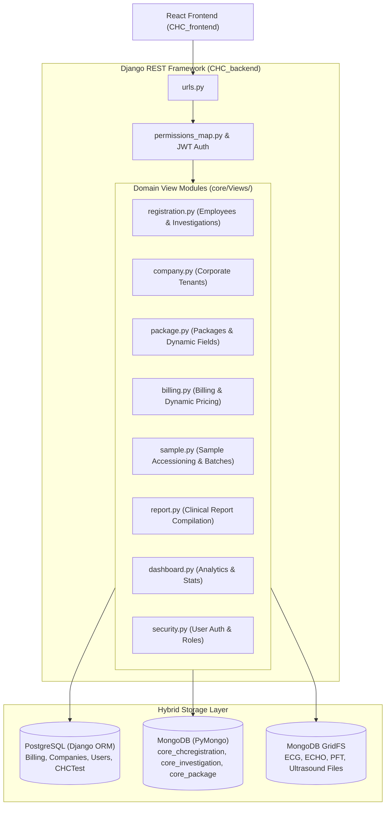

# Corporate Health Checkup (CHC) - Backend Service

The backend REST API service for the Corporate Health Checkup (CHC) platform, built on **Django REST Framework (DRF)** using a **Hybrid Database Architecture** (PostgreSQL for relational transactional models & MongoDB with GridFS for dynamic clinical documents and medical files).

---

## 🏛 Architecture Overview



---

## 🗄️ Hybrid Database Architecture

| Database | Layer | Purpose / Collections |
| :--- | :--- | :--- |
| **PostgreSQL** | Django ORM (`models.py`) | Structured relational entities: `Billing`, `Company`, `Register`, `CHCtest`, `Sample`, `Batch`, `AuditModel`. |
| **MongoDB** | PyMongo (`Corporatehealthcheckup`) | Dynamic, document-oriented entities: `core_chcregistration`, `core_investigation`, `core_package`, `core_company`, `core_billing`. |
| **MongoDB GridFS** | `gridfs.GridFS(db)` | Binary medical test attachments: ECHO PDFs, ECG traces, Ultrasound images, PFT documents. |

---

## 📂 Backend Project Structure

```
CHC_backend/
├── backend/
│   ├── __init__.py
│   ├── asgi.py
│   ├── settings.py             # Django settings & DB configurations
│   ├── urls.py                 # Root URL routing
│   └── wsgi.py
├── core/
│   ├── models.py               # PostgreSQL relational models
│   ├── urls.py                 # App URL mappings (/ _b_a_c_k_e_n_d/CHC/...)
│   ├── serializers.py          # DRF Serializers
│   ├── jwt_crypter.py          # AES token encryption / decryption
│   ├── jwt_gen.py              # JWT token issuer & parser
│   ├── auth/
│   │   ├── permissions.py      # Custom HasRolePermission
│   │   └── permissions_map.py  # Regex route-to-role mappings
│   └── Views/
│       ├── registration.py     # Employee registration, investigations CRUD, bulk ops
│       ├── company.py          # Company creation & package assignments
│       ├── package.py          # Dynamic package configuration
│       ├── billing.py          # Credit / Cash / Onsite / Offsite billing
│       ├── sample.py           # Sample accessioning, transfer & batching
│       ├── report.py           # Clinical report compilation & verification
│       ├── dashboard.py        # Analytics & checkup statistics
│       ├── security.py         # Login, user registration & tokens
│       └── investigation_fields.py # Dynamic field schema definitions
├── manage.py
├── requirements.txt
└── .env
```

---

## ⚙️ Environment Variables & Configuration

Create a [`.env`](file:///d:/SMRFT/Projects/CHC/CHC_backend/.env) file in the root of `CHC_backend`:

```env
SECRET_KEY=your_django_secret_key
DEBUG=True

# PostgreSQL Configuration
DB_NAME=chc_db
DB_USER=postgres
DB_PASSWORD=your_postgres_password
DB_HOST=localhost
DB_PORT=5432

# MongoDB Configuration
MONGO_URI=mongodb://localhost:27017/Corporatehealthcheckup
MONGO_DB_NAME=Corporatehealthcheckup
```

---

## 🛠 Setup & Execution

### 1. Create & Activate Virtual Environment
```powershell
python -m venv venv
.\venv\Scripts\activate
```

### 2. Install Dependencies
```powershell
pip install -r requirements.txt
```

### 3. Run Relational Migrations
```powershell
python manage.py migrate
```

### 4. Start Development Server
```powershell
python manage.py runserver 8000
```
API endpoints will be served at `http://localhost:8000/`.

---

## 🔗 Key API Route Groups

All endpoints are mapped under `/_b_a_c_k_e_n_d/CHC/`:

- **Auth & Security**: `/login/`, `/register/`, `/get_user_by_role/`
- **Companies & Packages**: `/create_company/`, `/companies/`, `/get_packages/`, `/create_package/`
- **Employee Registration**: `/register_employee/`, `/get_all_employees/`, `/bulk_upload_employees/`
- **Billing**: `/create_billing/`, `/get_billing/`, `/get_offsite_billings/`
- **Investigations**: `/save_investigation/`, `/get_investigations/`, `/bulk_upload_investigation_files/`
- **Samples & Batches**: `/collect_sample/`, `/create_batch/`, `/get_batches/`, `/transfer_sample/`
- **Reports**: `/get_chc_report/`, `/approve_investigation/`, `/overall_approve/`

---

## 🛡️ Best Practices for Development

1. **Native BSON Storage**: Always use PyMongo collections directly for `core_investigation` and `core_chcregistration` to maintain schema agility.
2. **Defensive JSON Parsing**: Any client payload or Mongo value could be a stringified JSON string or a native dict/list. Always apply `json.loads` guards.
3. **No Hardcoded IDs**: Never use fallback company identifiers like `"CHC002"`. Always resolve context dynamically.
4. **Audit Logging**: Populate `created_by`, `lastmodified_by`, and `lastmodified_date` on every write operation.
